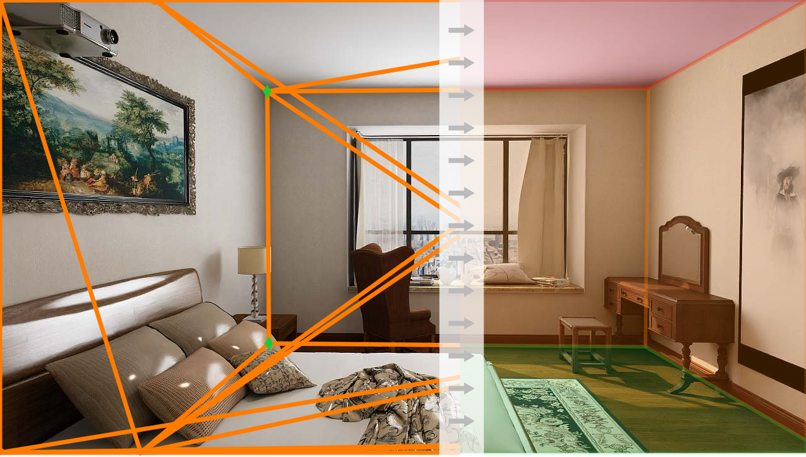

# Polygon Detection for Room Layout Estimation using Heterogenous Graphs and Wireframes
This repo contains code for training and inference of our model for connected polygon detection in RGB images.
See the [preprint on arXiv]() of "Polygon Detection for Room Layout Estimation using Heterogenous Graphs and Wireframes" for more details.



*Conceptual image of how the model works with wireframes and polyons.*


## Clone repo and get submodules
```
git clone --recurse-submodules git@github.com:DavidGillsjo/polygon-HGT.git
```
alternatively
```
git clone git@github.com:DavidGillsjo/polygon-HGT.git
git submodule init
git submodule update
```

## Docker
We supply a [Dockerfile](docker_cuspatial/Dockerfile) to build a docker image which can run the code.
First, modify [line 7](docker_cuspatial/Dockerfile#L7) so that `gpu_arch` matches your GPU architecture. See for example [this blog post](https://arnon.dk/matching-sm-architectures-arch-and-gencode-for-various-nvidia-cards/) to find your arch code.

Then build and run:
```
cd docker_cuspatial
./build_docker.sh
./run_docker.sh
```
You will find your `HOME` directory mounted to `/host_home`.

## Fix Python path
Add `parsing` folder to python path for correct imports.
```
source init_env.sh
```

## Download Model Weights
Here you find the pre-trained models to reproduce the result from the paper.
- [Cycle based model](https://vision.maths.lth.se/davidg-data/polygon-hgt/model_proposal_s3d.pth)
- [Polygon-HGT joint prediction](https://vision.maths.lth.se/davidg-data/polygon-hgt/model_gnn_s3d.pth)
- [Polygon-HGT simulated wireframe](https://vision.maths.lth.se/davidg-data/polygon-hgt/model_gnn_s3d.pth)

You may for example put the model weights in the `data` folder, the rest of this README will assume you did.

## Generate Annotations
To generate the annotations,
- Download Structured3D, see [official website](https://structured3d-dataset.org/).
You may use [this script](data/download_structured3D.py).
- Run `python3 preprocessing/structured3D2planes_simple.py --help` for instructions.


## Build
To run the network, some C-code needs compiling.
```
./build.sh
```

## Inference
There are a number of ways to run inference, see `python3 scripts/test.py --help` for details.

### Run inference on test set with simulated wireframe
To run on the test set, do
```
cd scripts
python3 test.py \
--config-file ../config/Pred-plane-from-GT-GNN.yaml \
CHECKPOINT ../data/model_polygon_hgt_simulated.pth
OUTPUT_DIR ../runs/test
```
To run on the validation data, add the flag `--val`.

### Run inference on your own images with joint prediction
To run on a set of images
```
cd scripts
python3 test.py \
--config-file ../config-files/Pred-simple-plane-S3D-GNN.yaml \
--img-folder <my-image-folder> \
CHECKPOINT ../data/model_polygon_hgt_joint.pth
```
and the result will be placed in `<my-image-folder>/test`.

## Train
The different models are trained with their respective config file which exists in both simulated and joint prediction versions.
The config files are placed in the folder `config-files`.
| Model / Variant | Simulated wireframe     | Joint detection           |
| -------------   | -------------           | -------------             |
| Cycle based     | Pred-plane-from-GT      | Pred-simple-plane-S3D     |
| Polygon-HGT     | Pred-plane-from-GT-GNN  | Pred-simple-plane-S3D-GNN |


### Train Polygon-HGT wit simulated wireframes
```
cd scripts
python3 train.py \
--config-file ../config-files/Pred-plane-from-GT-GNN.yaml
```
To monitor the training we have used W&B, but there is some support for tensorboard.
W&B may be configured [here](./parsing/utils/logger.py#L75).


## Citation
If you use it in your research, please cite
```
```
